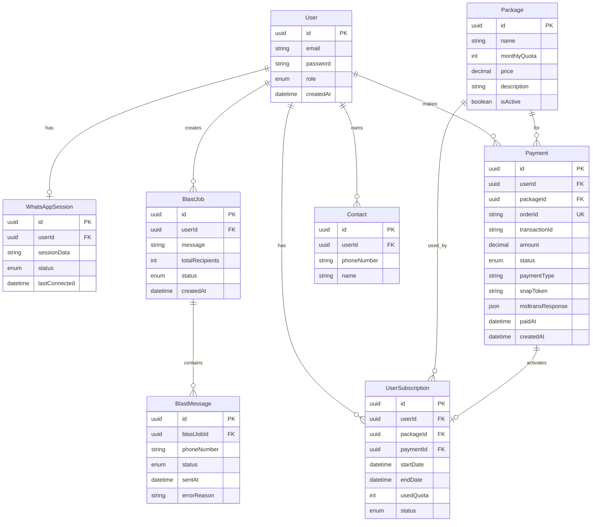

# WhatsApp Blasting SaaS Platform - Fase Pengerjaan

## 📋 Ringkasan Proyek

Platform SaaS multi-tenant untuk WhatsApp Blasting dengan fitur:

- Pengguna subscribe ke paket layanan
- Koneksi WhatsApp via QR scan
- Kirim pesan massal ke banyak nomor
- Manajemen queue, delay, dan reporting

---

## 🔧 Tech Stack

| Layer           | Teknologi             |
| --------------- | --------------------- |
| Frontend        | Next.js, Tailwind CSS |
| Backend         | Node.js (NestJS)      |
| Queue           | Redis + BullMQ        |
| WhatsApp Engine | whatsapp-web.js       |
| Database        | PostgreSQL            |
| Payment Gateway | Midtrans              |
| Infra           | Docker                |

---

## 📅 Fase Pengerjaan

### **FASE 1: Foundation & Setup** _(Estimasi: 1-2 hari)_

#### 1.1 Project Initialization

- [ ] Setup NestJS project dengan TypeScript
- [ ] Konfigurasi ESLint, Prettier, dan Husky
- [ ] Setup Docker Compose untuk development
- [ ] Konfigurasi environment variables

#### 1.2 Database Setup

- [ ] Setup PostgreSQL dengan Docker
- [ ] Konfigurasi TypeORM/Prisma
- [ ] Design dan buat database schema awal
- [ ] Setup migration system

#### 1.3 Redis Setup

- [ ] Setup Redis dengan Docker
- [ ] Konfigurasi BullMQ
- [ ] Test basic queue functionality

---

### **FASE 2: Authentication & Authorization** _(Estimasi: 2-3 hari)_

#### 2.1 User Management

- [ ] Buat User entity dengan role (Admin/User)
- [ ] Implementasi register endpoint
- [ ] Implementasi login endpoint dengan JWT
- [ ] Password hashing dengan bcrypt

#### 2.2 Authorization

- [ ] Implementasi Guards untuk role-based access
- [ ] Buat decorator untuk protected routes
- [ ] Middleware untuk token validation

#### 2.3 Admin Features

- [ ] CRUD users untuk admin
- [ ] User activation/deactivation
- [ ] View all users list

---

### **FASE 3: Subscription & Payment System (Midtrans)** _(Estimasi: 4-5 hari)_

#### 3.1 Package Management

- [ ] Buat Subscription Package entity
- [ ] CRUD packages (Admin only)
- [ ] Define package limits (quota, features)
- [ ] Set pricing untuk setiap package

#### 3.2 Midtrans Payment Integration

- [ ] Setup Midtrans SDK (midtrans-client)
- [ ] Konfigurasi Server Key & Client Key
- [ ] Buat Payment entity untuk tracking transaksi
- [ ] Implementasi Snap Token generation
- [ ] Create payment endpoint (generate snap token)
- [ ] Implementasi Notification Handler (webhook)
- [ ] Handle payment status: pending, success, failed, expired
- [ ] Integrasi dengan frontend Snap.js popup

#### 3.3 User Subscription

- [ ] Buat UserSubscription entity
- [ ] Auto-activate subscription setelah payment success
- [ ] Subscribe/unsubscribe endpoints
- [ ] Subscription validation middleware
- [ ] Quota tracking system
- [ ] Subscription renewal flow

#### 3.4 Subscription Enforcement

- [ ] Check subscription before blast
- [ ] Block expired subscriptions
- [ ] Quota usage tracking
- [ ] Grace period handling (optional)

---

### **FASE 4: WhatsApp Integration** _(Estimasi: 3-4 hari)_

#### 4.1 WhatsApp Session Management

- [ ] Integrasi whatsapp-web.js
- [ ] Buat WhatsAppSession entity
- [ ] Generate QR code endpoint
- [ ] Session state management (connecting, connected, disconnected)

#### 4.2 Session Persistence

- [ ] Store session credentials securely
- [ ] Auto-reconnect mechanism
- [ ] Handle session timeout/logout
- [ ] One session per user enforcement

#### 4.3 Session Monitoring

- [ ] WebSocket untuk real-time QR update
- [ ] Session status endpoint
- [ ] Admin monitoring dashboard data

---

### **FASE 5: Message Blasting System** _(Estimasi: 4-5 hari)_

#### 5.1 Contact/Phone Number Management

- [ ] Buat Contact entity
- [ ] Bulk phone number input endpoint
- [ ] Phone number validation (format, country code)
- [ ] Import from CSV/Excel

#### 5.2 Message Queue System

- [ ] Buat BlastJob entity
- [ ] Buat BlastMessage entity
- [ ] Implementasi BullMQ producer
- [ ] Configurable delay between messages

#### 5.3 Message Worker

- [ ] Implementasi BullMQ consumer/worker
- [ ] Send message via WhatsApp session
- [ ] Handle success/failure per message
- [ ] Retry mechanism with backoff

#### 5.4 Rate Limiting & Anti-Spam

- [ ] Rate limiter per user
- [ ] Random delay variation
- [ ] Daily/hourly message limits
- [ ] Detect potential spam patterns

---

### **FASE 6: Reporting & History** _(Estimasi: 2-3 hari)_

#### 6.1 Blast History

- [ ] Store blast job history
- [ ] Store individual message status
- [ ] Endpoint untuk list blast history

#### 6.2 Delivery Status

- [ ] Track: pending, sent, delivered, failed
- [ ] Real-time status update via WebSocket
- [ ] Detailed failure reasons

#### 6.3 Statistics

- [ ] Total messages sent per user
- [ ] Success/failure rate
- [ ] Daily/weekly/monthly reports
- [ ] Admin dashboard statistics

---

### **FASE 7: Error Handling & Recovery** _(Estimasi: 2 hari)_

#### 7.1 Session Recovery

- [ ] Auto-reconnect on disconnect
- [ ] Graceful session cleanup
- [ ] Handle WhatsApp ban detection

#### 7.2 Queue Recovery

- [ ] Handle failed jobs
- [ ] Dead letter queue
- [ ] Manual retry mechanism

#### 7.3 System Monitoring

- [ ] Health check endpoints
- [ ] Logging with Winston/Pino
- [ ] Error alerting (optional: email/Slack)

---

### **FASE 8: API Documentation & Testing** _(Estimasi: 2 hari)_

#### 8.1 Documentation

- [ ] Swagger/OpenAPI setup
- [ ] Endpoint documentation
- [ ] Authentication flow docs

#### 8.2 Testing

- [ ] Unit tests untuk services
- [ ] Integration tests untuk controllers
- [ ] E2E tests untuk critical flows

---

### **FASE 9: Deployment Preparation** _(Estimasi: 1-2 hari)_

#### 9.1 Docker Production

- [ ] Multi-stage Dockerfile
- [ ] Docker Compose untuk production
- [ ] Environment configuration

#### 9.2 Security Hardening

- [ ] Rate limiting pada API
- [ ] CORS configuration
- [ ] Helmet middleware
- [ ] Input validation/sanitization

---

## 🏗️ Database Schema (High-Level)

---

## ⚠️ Risiko & Mitigasi

| Risiko                   | Mitigasi                                               |
| ------------------------ | ------------------------------------------------------ |
| WhatsApp ban karena spam | Rate limiting ketat, delay random, limit harian        |
| Session disconnect       | Auto-reconnect, session persistence, graceful recovery |
| Queue overload           | BullMQ dengan concurrency limit, backpressure          |
| Data leak antar user     | Strict data isolation, query scoping per userId        |
| Credential theft         | Encrypt session data, secure storage                   |

---

## 📊 Prioritas Pengerjaan

1. **High Priority**: Fase 1-4 (Foundation hingga WhatsApp Integration)
2. **Medium Priority**: Fase 5-6 (Blasting & Reporting)
3. **Lower Priority**: Fase 7-9 (Error handling, Docs, Deployment)

---

## User Review Required

> [!IMPORTANT]
> Mohon review fase pengerjaan di atas. Beberapa hal yang perlu diklarifikasi:
>
> 1. Apakah urutan fase sudah sesuai dengan prioritas bisnis?
> 2. Apakah ada fitur yang perlu ditambah/dikurangi?
> 3. Apakah estimasi waktu realistis dengan resources yang ada?
> 4. Apakah ingin memulai dari fase tertentu terlebih dahulu?
